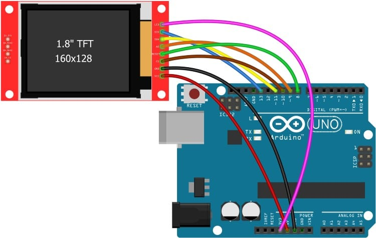

# TFT-Arduino-Mini-USB-Monitor

---
⚖️ **Aviso legal**  
Este proyecto (software y hardware) está protegido por la **Licencia Sarco-rdf Open Hardware/Software License v1.0 (NO-COMERCIAL)**.  
Queda prohibido su uso comercial sin autorización expresa del autor.  

📄 Ver la licencia completa en: [LICENSE](./LICENSE)  
---

Monitor usb mini con arduino para ver salida de terminales, pantalla completa o area seleccionada, se puede mejorar con rasperry py pico o zero para poner en unos lentes y extender la mira de videojuegos para mayor presicion.

═════════════════════════════════════════════════════════════════════════  

### Modo de uso

1. Conectar la TFT al Arduino UNO como en la [imagen](images/Conexion_TFT.jpg).  
2. Cargar el archivo [`TFT_USB_Monitor.ino`](TFT_USB_Monitor/TFT_USB_Monitor.ino) al Arduino UNO.  
3. Abrir el archivo [`TFT_Capture.py`](TFT_Capture/TFT_Capture.py) con la terminal y Python3 o Visual Studio Code con la extensión de Python.  
4. Seleccionar área y darle a **Start Transmision**, o para pantalla completa darle a **Start Full Monitor**.  
5. Cuando termines, simplemente haz clic en **Stop Transmisión** y luego en **Salir**.

═════════════════════════════════════════════════════════════════════════  

### ⚠️ Posibles errores y soluciones

1. Asegúrate de que no tienes el monitor serial de Arduino abierto, de lo contrario no cargará el programa Python (error: **Access Denied**).  
2. Verifica que el puerto COM esté correctamente configurado en el archivo [`TFT_Capture.py`](TFT_Capture/TFT_Capture.py).  
3. Si la imagen se ve mal, espera unos segundos. Si no se arregla, puedes ajustar los baudios en:
   - [`TFT_Capture.py`](TFT_Capture/TFT_Capture.py) → línea 15  
   - [`TFT_USB_Monitor.ino`](TFT_USB_Monitor/TFT_USB_Monitor.ino) → línea 15  
   - Valores óptimos funcionales: `9600`, `115200`, `250000`
   - Cuanto más bajo el valor, más lenta será la transmisión.
   - ⚠️ **IMPORTANTE:** Ambos archivos deben tener el mismo valor.  

4. Asegúrate de tener instaladas todas las dependencias necesarias tanto en el IDE de Arduino como en Python.
5. Antes de modificar la velocidad de transmisión en los archivos, asegúrate de presionar el botón **Salir** en la interfaz Python.  
   Si no lo haces, el puerto COM seguirá ocupado y no podrás subir el nuevo sketch al Arduino (error: **Access Denied**).

═════════════════════════════════════════════════════════════════════════  

  

