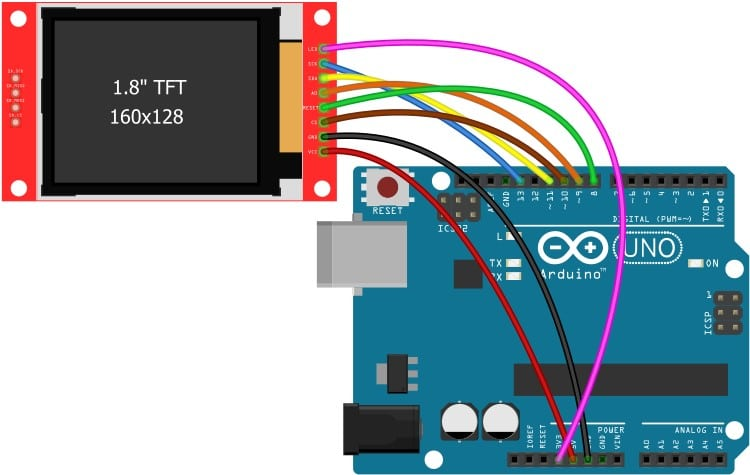

# tft-arduino-mini-usb-monitor
Monitor usb mini arduino para ver salida de terminal, pantalla completa o area seleccionada, se puede mejorar con rasperry py pico o zero para poner en unos lentes y extender la mira de videojuegos para mayor presicion.

════════════════════════════════════════════════════════════════════════════════════════════════════════════════════════════════════════════════════════════════════════════════════════

Modo de uso:  1 Conetar la tft al arduino 1 como en la [imagen.](images/conexion_tft.jpg)
              2 Cargar el archivo TFT_USB_Monitor.ino al Arduino UNO.
              3 Abrir el archivo python con terminal o Visual Studio Code.
              4 Seleccionar area y darle a Start Transmision o para pantalla completa darle a Start Full Monitor.
              5 Cuando acabe simplemente de click a Stop Transmisión y Salir.

════════════════════════════════════════════════════════════════════════════════════════════════════════════════════════════════════════════════════════════════════════════════════════

Posibles errores y solucioiones
              1 Asegurese de que no tiene el monitor serial de arduino abierto de lo contrario no cargara el programa python dando el error Access Denied.
              2 Asegurese de setear correctamente el puerto COM en el archivo TFT_Capture.py
              3 Si la imagen se ve fea espere unos segundos si no se arregla puede cambiar los baudios en el archivo TFT_Capture.py (linea: 15) y TFT_USB_Monitor.ino (linea: 15).
                IMPORTANTE: Ambos archivos deben tener el mismo numero, mientras mas bajo el valor mas lenta la transmision.
              3.1 Valores optimos funcionale: 9600; 115200; 250000.
              4 Falta de dependencias tanto en el ide de arduino como en python.
              5 Antes de cambiar la velocidad en ambos archivos asegurese de darle al boton Salir, de lo coontrario no podra subir el nuevo Sketch con la velocidad modificada al arduino
                ya  que el puerto COM saldra como ocupado o Access Denied.

════════════════════════════════════════════════════════════════════════════════════════════════════════════════════════════════════════════════════════════════════════════════════════

